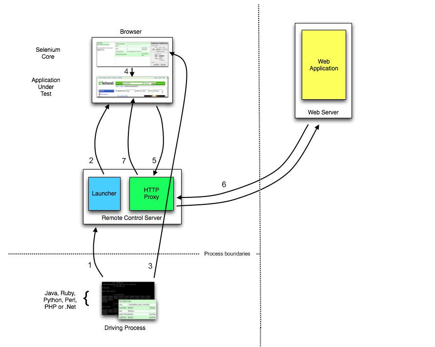

# Web 自动化测试

## Selenium 原理

### Selenium 1.0 工作原理

**核心**： Selenium RC （ Remote Control ）

 **Selenium RC 利用的原理**   ： JavaScript 代码可以很方便地获取页面上的任何元素并执行各种操作 

**同源政策** ： 只有来自**相同域名、端口和协议**的 JavaScript 代码才能被浏览器执行 

**Selenium RC 组成** ：

 **Selenium RC Server** ：

+  Selenium Core ：被注入到浏览器页面中的 JavaScript 函数集合，用来实现界面元素的识别和操作 
+  Http Proxy ： 作为代理服务器修改JavaScript的源，以达到“欺骗”被测站点的目的 
+  Launcher ： 用来在启动测试浏览器时完成 Selenium Core 的注入和浏览器代理的设置 

**Client Libraries**： 是测试用例代码向 Selenium RC Server 发送 Http 请求的接口，支持多种语言

**Selenium RC的执行流程 **：

具体如下：

+  测试用例通过基于不同语言的 Client Libraries 向 Selenium RC Server 发送 Http 请求，要求与其建立连接 
+  连接建立后，Selenium RC Server 的 Launcher 就会启动浏览器或者重用之前已经打开的浏览器，把Selenium Core（JavaScript 函数的集合）加载到浏览器页面当中，并同时把浏览器的代理设置为 Http Proxy 
+  Selenium Core 接收到指令后，执行操作 
+  如果浏览器收到新的页面请求信息，则会发送Http请求来请求新的 Web 页面。由于 Launcher 在启动浏览器时把 Http Proxy 设置成为了浏览器的代理，所以 Selenium RC Server 会接收到所有由它启动的浏览器发送的请求 
+ Selenium RC Server 接收到浏览器发送的 Http 请求后，重组 Http 请求以规避“同源策略”，然后获取对应的Web 页面。
+ Http Proxy 把接收的 Web 页面返回给浏览器，浏览器对接收的页面进行渲染。

###  **Selenium 2.0的工作原理** 

**核心**：Selenium WebDriver 

**原理**： 使用浏览器原生的 WebDriver 实现页面操作 

