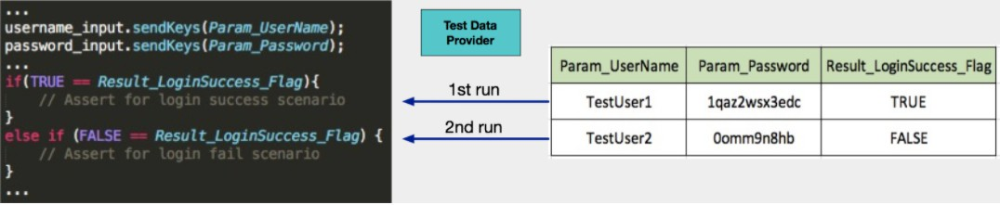

# 数据驱动与页面对象模型

## 数据驱动测试

**概念**：将测试数据与脚本分离，提高脚本复用性

**作用**：

+  解决了大量重复脚本的问题，实现了“测试脚本和数据的解耦”
+  数据文件中不仅可以包含测试输入数据，还可以包含测试验证结果数据，甚至可以包含测试逻辑分支的控制变量
+  不仅适用于GUI测试，还可以用于API测试、接口测试、单元测试等

## 页面对象（Page Object）模型

**上述代码存在的问题**：

+  脚本逻辑层次不够清晰，属于 All-in-one 的风格，既有页面元素的定位查找，又有对元素的操作 
+  脚本的可读性差
+  脚本的每一行都直接描述各个页面上的元素操作，很难一眼看出脚本更高层的业务测试流程 
+  通用步骤在大量测试脚本中重复出现

**使用模块化封装**：

**优势**：

+  脚本可读性高，逻辑层次清晰
+  减少通用步骤在大量测试脚本中重复出现

**页面模型核心**： 以页面（Web Page 或者Native App Page）为单位模块化封装页面上的控件以及控件的部分操作 

进化上面的代码：

