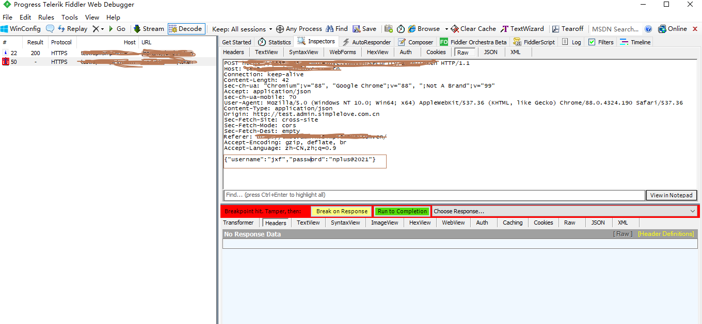

# 断点

## 1. 全局断点

+ 请求前断点

  设置全局请求前断点，会将所有经过 Fiddler 的接口在发送请求到 Fiddler 的时候，Fiddler 会暂停向服务器发送请求，此时，可以篡改接口的请求数据。

  全局请求前断点设置，在 Rules-Automatic Breakpoints 中选择 Before Resquests 如下：

  

  或者直接在状态栏，点击一下，待出现下面的图标，即表示开启全局请求前断点：

  

  设置成功后，可以对请求的接口进行数据的修改，如：

  

  此时可以修改提交的数据，然后点击绿色的 Run to Completion 后，Fiddler 将该请求发送至服务器，获取服务器返回的数据

+ 请求后断点

  

## 2. 局部断点

