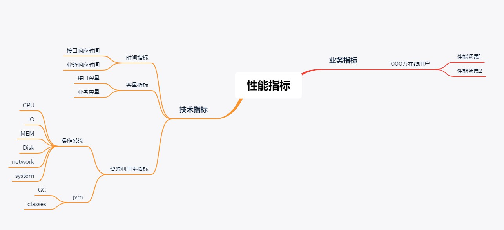
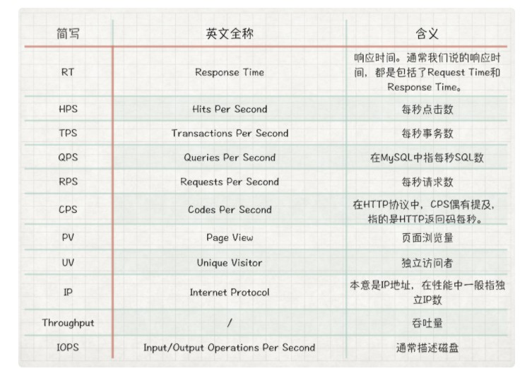
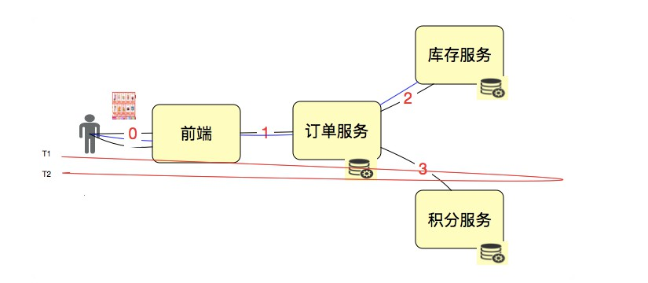

# 性能指标理解

## 指标间关系

包含：业务指标、技术指标

**两者之间关系**：是映射的关系，技术指标在业务场景的前提下制定

例如：系统要支持 1000万 人在线

**常用性能指标表示法**：不包括资源指标

## 指标理解

### TPS（重要）

含义：每秒事务数

**如何定义 T**：根据场景的目的和 T 的作用定义 T

比如：接口层性能测试，T 可定义为接口级；业务级性能测试，T 可直接定义为每个业务步骤和完整的业务流

+ 单独测试接口 1 2 3，则 T 就是接口级
+ 从用户角度下单，接口 1 2 3 处于同一个业务，T 即为业务级

**作用**：反应系统的处理能力

### QPS 

**不同描述，不同意义**：

+ 描述数据库中的 Query Per Second，表示数据库中 sql 的每秒执行条数
+ 描述前端每秒查询数，不包括插入、更新、删除操作

**不足**：不够全面的描述系统的性能，不建议使用此指标描述系统整体性能

### RPS

含义：每秒请求数

**不同描述，不同意义**：

用户点击 1 次，发出 3 个 Http Resquest，调用 2次 订单服务，2次 库存服务，1次 积分服务，Request 如何计算

+ 描述整体，算有 3个 RPS
+ 从 HTTP 理解，Http Request 是比较准确的描述

### CPS／CPM

含义：每秒、每分钟调用次数，在接口级测试中常用到

**不同描述，不同意义**：

+ 接口级

+ 操作系统级，描述系统性能能力，会出现混乱

  **处理方式**：

  + 统一概念，在各层面上加上限制条件描述
  + 团队中定义清楚术语的使用层级
  + 如果没有定义使用层级，再说概念时，加上相应背景条件

### 响应时间 RT（重要）

RT = T2 - T1

