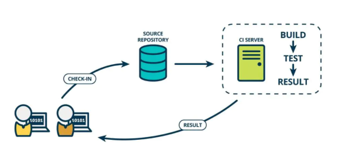

# Jenkins 

## 简介

+ 一款开源的持续集成的工具
+ 底层语言为 Java
+ 通常与版本管理工具( SVN、Git等)、构建工具(Maven、Ant、Gradle等)结合使用

## CI/CD 介绍

### CI

Continuous integration ，持续集成，是一种开发时间

持续集成强调开发人员提交了代码之后，立即进行构建、测试

### CD

 Continuous Delivery，持续交付，在持续集成基础上，将集成后的代码部署到更贴近真实运行环境中

