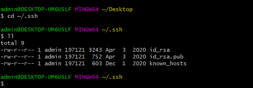

# 秘钥生成

## 安装

官网网址：https://git-scm.com/download/win

从官网中下载相应的文件进行安装

## 添加秘钥

**步骤**：

+ 安装好 git 后，打开 git bash

+ 输入 `cd ~/.ssh` ，再输入 `ll` 查看有无配置

  

  

+ 无配置时，使用 `cd ~` 命令后使用 `ssh-keygen.exe` 根据相应的提示进行配置

  

+ 配置完成后，进入 `/c/Users/admin/.ssh` 文件夹下，将 .pub 文件中的内容复制到 git 上即可添加成功

