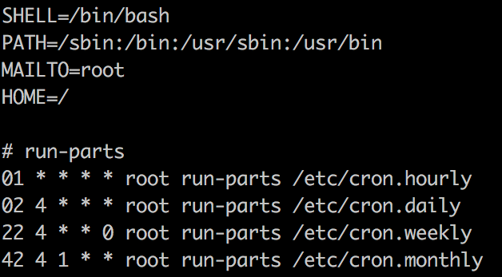

# Crontab

## 简介

作用：用于设置周期性被执行的指令

定时任务包含：

+ cron：服务名称
+ crond：后台进程
+ crontab：计划任务表

## 任务分类

### 系统任务调度

系统周期性所要执行的工作

在 /etc 目录下有一个 crontab 文件，如下：

前四行用来配置 crontab 任务运行的环境变量：

+ SHELL 

   指定了系统要使用哪个 shell 

+ PATH

   指定了系统执行命令的路径 

+ MAILTO

   指定了crond 的任务执行信息将通过电子邮件发送给 root 用户，如果 MAILTO 变量的值为空，则表示不发送任务执行信息给用户 

+ HOME

   指定了在执行命令或者脚本时使用的主目录

### 用户任务调度

 用户定期要执行的工作 

 使用 crontab 来定制自己的计划任务

 所有用户定义的 crontab 文件都被保存在 /var/spool/cron 目录下  

## Crontab 命令

+ crontab [-u user] file

   将 file 做为 crontab 的任务列表文件并载入 crontab 

   如果没有指定这个文件，crontab 命令将接受标准输入（键盘）上键入的命令，并将它们载入crontab 

+ crontab [-u user] -e

  编辑某个用户的 crontab 文件内容

  如果不指定用户，则表示编辑当前用户的 crontab 文件内容。 

+ crontab [-u user] -l

  显示某个用户的 crontab 文件内容

  如果不指定用户，则表示显示当前用户的c rontab 文件内容。 

+ crontab [-u user] -[i]r

  从 /var/spool/cron 目录中删除某个用户的 crontab 文件

  如果不指定用户，则默认删除当前用户的 crontab 文件

  -i 参数指定在删除用户的 crontab 文件时是否给确认提示 

## Crontab 内容格式

