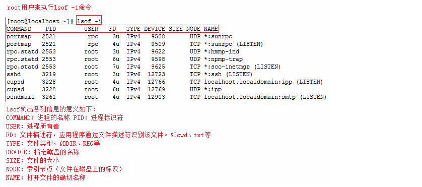

# 查看端口占用情况

## losf 命令

**语法格式**：

```
lsof -i:端口号
```

示例：

```
# lsof -i:8000
COMMAND   PID USER   FD   TYPE   DEVICE SIZE/OFF NODE NAME
nodejs  26993 root   10u  IPv4 37999514      0t0  TCP *:8000 (LISTEN)
```



**注意**：losf -i 需要 root 用户的权限来执行

**其他常用的命令**：


## netstat 命令

**语法格式**：

```
netstat -tnlp | grep 端口号
```

**常见参数**：

| 参数 | 说明                             |
| ---- | -------------------------------- |
| -t   | 显示 tcp 相关协议的端口情况      |
| -u   | 显示 udp 相关协议的端口情况      |
| -n   | 不显示别名，显示 IP 地址         |
| -l   | 仅列出除与 listen 状态的服务状态 |
| -p   | 显示建立相关链接的程序名         |
| -a   | 显示所有的端口信息               |

示例：

```
# netstat -tunlp | grep 8000
tcp        0      0 0.0.0.0:8000            0.0.0.0:*               LISTEN      26993/nodejs  
```

