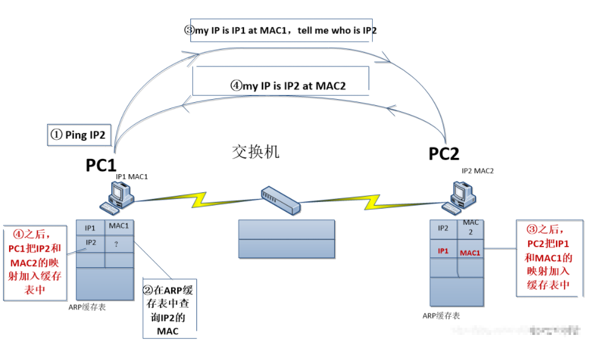

# ARP 协议

简介： ARP 全称 Address Resolution Protocol，地址解析协议

目的：实现 IP 地址到 MAC 地址的转换

**MAC 地址**：

+ 设备的唯一标识，基本在出厂时就已经固定，且不易更改，一般为48 位
+ 是数据链路层能够识别的地址

Windows 查看 MAC 地址：

```
ipconfig /all
```


**IP 地址**：

+ 是网络层标识的地址
+ 一般都是人为指定的，32位，常用点分十进制表示

在 OSI 模型中，一方发送数据时，需要从上到下对数据进行封装，另一方收到数据时需要对数据从上到下进行解包，但是网络层识别的是 IP 地址，数据链路层识别的是 MAC 地址，因此需要对 IP 和 MAC 进行映射。

### ARP 原理之请求应答

**ping 命令之 ARP 请求应答栗子**：

发送方：PC1，IP 地址为 IP1，MAC 地址为 MAC1

接收方：PC2，IP 地址为 IP2，MAC 地址为 MAC2



步骤：

1. PC1 发送 ping IP2，由上到下封装数据
2. 数据链路层封装 PC2 的 MAC 
   + PC1先在本地的 ARP 缓存表中查找
   + 本地缓存中没有找到，在同一广播域内发送广播消息寻求 PC2 MAC，如果同一广播域内没有回应，则会通过二层交换机进行转发到其他的局域网内
   + 等收到 PC2 的 MAC 地址后，封装到数据中，随后存入本地的缓存表中
3. 数据封装完成后，将数据发送给 PC2 
4. PC2 收到数据后，开始解包，拿到 PC1 的 MAC 后存入自己本地的缓存

**查看 arp 缓存表**：

```
arp -a
```


### ARP 报文

**报文格式**：


根据上面描述的过程，在PC1 ping PC2 时使用 wireshark 抓包如下：

+ ARP请求包

  PC1 本地 ARP 缓存表中未有 PC2 MAC 地址时，会进行广播

  

+ ARP 响应包

  PC2 收到广播消息后，以单播的形式回复给 PC1

  


