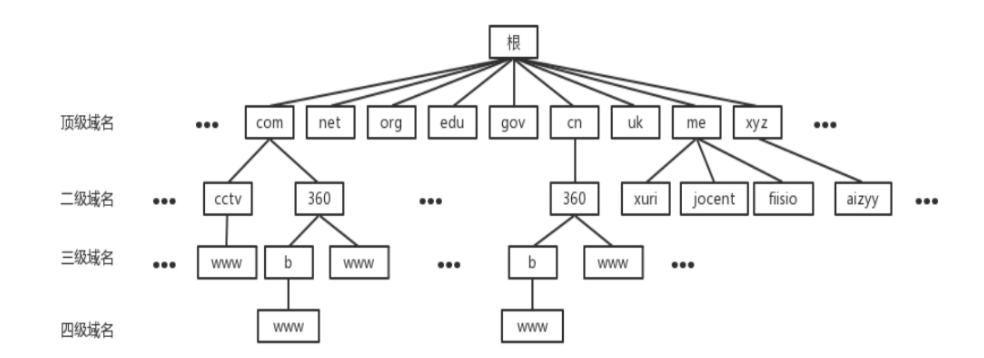

# DNS 协议

## 概述

DNS：Domain Name System，域名系统

目的：将域名转换为主机 IP 地址

端口号：53

使用协议：UDP

## 域名结构

### 域名层次结构

目的：保持唯一性

方法：采用层次结构的命名方法

+ 每一个域名都是一个标号序列，用字母、数字和链接符组成
+ 标号序列总长度不能超过 255 个字符，由点号分割成一个个的标号
+ 每个标号应该在 63 个字符之内，可以看成一个层次的域名
+ 级别最低的域名写在左边，最高的域名写在右边

例子：常用的 www.baidu.com

+ com：一级域名，表示一个企业域名
+ baidu：二级域名，指公司名
+ www：表示万维网

### 域名分级

