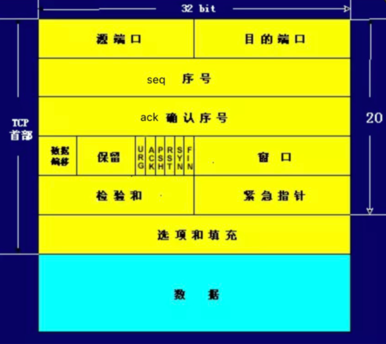

# TCP 协议

## 简介

TCP： Transmission Control Protocol， 传输控制协议， 是一种面向连接(连接导向)的、可靠的、 基于 IP 的传输层协议 

网络层级：在 OSI 模型中属于第四层

具体网络层级及功能可以参考[网络分层](/basic-skills/network/网络分层/)

## TCP 头部结构和字段

TCP 报文：TCP 协议是封装在 IP 数据包中

TCP 报文格式：

字段解释：

+ 源端口和目的端口
  + 各占 2 个字节
  + 端口加上源/目的 IP 唯一确定一个 TCP 连接
+ 序号
  + 占 4 个字节， 是本报文段所发送的数据项目组第一个字节的序号 
  +  TCP 传送的数据流中，每一个字节都有一个序号(包含了数据的字节数)
+ 确认序号
  +  占 4 个字节，是期望收到对方下次发送的数据的第一个字节的序号 
  +  确认序号应该是上次已成功收到数据字节序号 +1 
  +  只有 ACK 标志为 1 时，确认序号才有效 
+ 数据偏移
  +  占 4 比特，表示数据开始的地方离 TCP 段的起始处有多远，即 TCP 段首部的长度
  +   由于首部长度不固定，因此数据偏移字段是必要的 
  +  数据偏移以 4 个字节为长度单位
  +  TCP首部的最大长度是 60 个字节，即偏移最大为 15 个长度单位=1532位=154字节 
+ 保留
  +  6 比特，供以后应用，现在置为 0 
+ 6个标志位比特
  + URG：当 URG=1 时，注解此报文应尽快传送，而不要按本来的列队次序来传送。与“紧急指针”字段共同应用，紧急指针指出在本报文段中的紧急数据的最后一个字节的序号，使接管方可以知道紧急数据共有多长
  +  ACK：只有当 ACK=1 时，确认序号字段才有效
  +  PSH：当 PSH=1 时，接收方应该尽快将本报文段立即传送给其应用层
  +  RST：当 RST=1 时，表示出现连接错误，必须释放连接，然后再重建传输连接。复位比特还用来拒绝一个不法的报文段或拒绝打开一个连接
  +  SYN：SYN=1,ACK=0 时表示请求建立一个连接，携带 SYN 标志的 TCP 报文段为同步报文段 
  +  FIN：发端完成发送任务
+ 窗口
  +  TCP通过滑动窗口的概念来进行流量控制，解决发送端发送数据的速度和接收端接收速度却不一致的情况 
  +  滑动窗口可以理解成接收端所能提供的缓冲区大小
  + TCP 利用一个滑动的窗口来告诉发送端对它所发送的数据能提供多大的缓冲区
  +  窗口大小是一个 16bit 字段，因而窗口大小最大为 65535 字节 
+ 校验和
  +  检验 TCP 首部和数据，是一个强制性的字段 
  +  一定是由发端计算和存储，并由收端进行验证
+ 紧急指针
  +  只有当 URG 标志置 1 时紧急指针才有效 
  +  紧急指针是一个正的偏移量，和序号字段中的值相加表示紧急数据最后一个字节的序号 

## TCP 三次握手和四次挥手

### 三次握手

**第一次握手**：

+ 客户端向服务器发出连接请求报文
+ 报文首部中的同步位 SYN 置为 1，同时随机生成初始序列号 seq=x
+ TCP 客户端进程进入 SYN-SENT(同步已发送)状态
+ 报文不携带数据

**第二次握手**：

+ TCP 服务器收到请求报文后，如果同意连接则发出确认报文
+ 确认报文中将 ACK/SYN 置为1，确认号 ack=x+1 ，随机初始化一个序列号 seq=y
+ TCP 服务进程进入了 SYN-RCVD(同步收到)状态
+ 报文不携带数据

**第三次握手**：

+ TCP 客户进程收到确认后，给出确认报文  ACK=1，ack=y+1 
+ TCP 连接建立，客户端进入 ESTABLISHED(已建立连接)状态 
+  ACK 报文段可以携带数据

**思考**：为什么要三次握手，两次握手不行么？

栗子：已失效的连接请求报文

+ client 发送了第一个连接的请求报文，由于网络不好，请求没有立即送达服务端，直到某个时间才到达 server
+ server 收到这个请求报文后，仍向 client 发出确认报文，同意连接

不采用三次握手：

+ 只要 server 发出确认，新的连接就建立了，不管是否这个请求是已经失效的请求
+ client 不需要向 server 发送确认请求，server 在连接建立后一直等待 client 发送数据，会导致很多资源被占用

### 数据传输

### 四次挥手

**第一次挥手**：

+ TCP 发送一个 FIN(结束)，用来关闭 client 到 server 的连接
+ client 发出连接释放报文，FIN=1，其序列号为 seq=u ，并停止发送数据
+ client 进入 FIN-WAIT-1(终止等待 1)状态

**第二次挥手**：

+ server 收到这个 FIN ，发出确认报文 ACK=1，ack=u+1，并且带上自己的序列号 seq=v
+ server 端进入 CLOSE-WAIT(关闭等待)状态
+ client 收到确认后， client 端进入 FIN-WAIT-2(终止等待2)状态，等待服务器发送连接释放报文
+ 在释放连接请求发送前，client 需要接受 server 发送的最后的数据

**第三次挥手**：

+ server 发送最后的数据后，发送释放报文，FIN=1，ack=u+1
+ server 进入 LAST-ACK(最后确认)状态，等待 client 确认

**第四次挥手**：

+ 