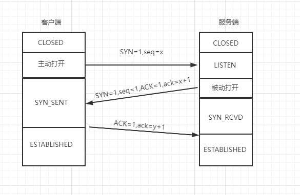
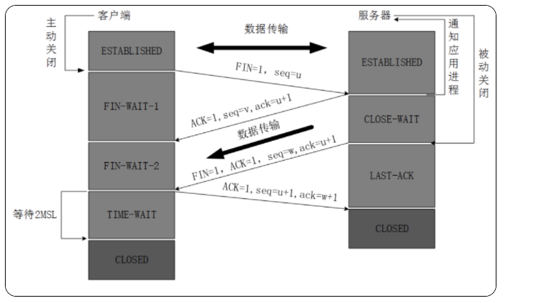
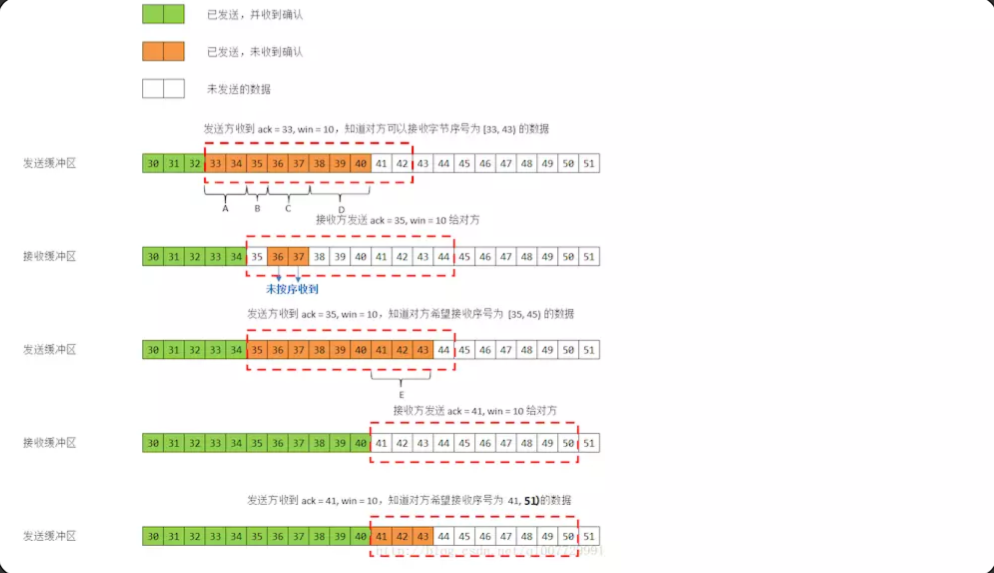

# TCP 协议

## 简介

TCP： Transmission Control Protocol， 传输控制协议， 是一种面向连接(连接导向)的、可靠的、 基于 IP 的传输层协议 

网络层级：在 OSI 模型中属于第四层

具体网络层级及功能可以参考[网络分层](/basic-skills/network/网络分层/)

## TCP 头部结构和字段

TCP 报文：TCP 协议是封装在 IP 数据包中

TCP 报文格式：

字段解释：

+ 源端口和目的端口
  + 各占 2 个字节
  + 端口加上源/目的 IP 唯一确定一个 TCP 连接
+ 序号
  + 占 4 个字节， 是本报文段所发送的数据项目组第一个字节的序号 
  +  TCP 传送的数据流中，每一个字节都有一个序号(包含了数据的字节数)
+ 确认序号
  +  占 4 个字节，是期望收到对方下次发送的数据的第一个字节的序号 
  +  确认序号应该是上次已成功收到数据字节序号 +1 
  +  只有 ACK 标志为 1 时，确认序号才有效 
+ 数据偏移
  +  占 4 比特，表示数据开始的地方离 TCP 段的起始处有多远，即 TCP 段首部的长度
  +   由于首部长度不固定，因此数据偏移字段是必要的 
  +  数据偏移以 4 个字节为长度单位
  +  TCP首部的最大长度是 60 个字节，即偏移最大为 15 个长度单位=1532位=154字节 
+ 保留
  +  6 比特，供以后应用，现在置为 0 
+ 6个标志位比特
  + URG：当 URG=1 时，注解此报文应尽快传送，而不要按本来的列队次序来传送。与“紧急指针”字段共同应用，紧急指针指出在本报文段中的紧急数据的最后一个字节的序号，使接管方可以知道紧急数据共有多长
  +  ACK：只有当 ACK=1 时，确认序号字段才有效
  +  PSH：当 PSH=1 时，接收方应该尽快将本报文段立即传送给其应用层
  +  RST：当 RST=1 时，表示出现连接错误，必须释放连接，然后再重建传输连接。复位比特还用来拒绝一个不法的报文段或拒绝打开一个连接
  +  SYN：SYN=1,ACK=0 时表示请求建立一个连接，携带 SYN 标志的 TCP 报文段为同步报文段 
  +  FIN：发端完成发送任务
+ 窗口
  +  TCP通过滑动窗口的概念来进行流量控制，解决发送端发送数据的速度和接收端接收速度却不一致的情况 
  +  滑动窗口可以理解成接收端所能提供的缓冲区大小
  + TCP 利用一个滑动的窗口来告诉发送端对它所发送的数据能提供多大的缓冲区
  +  窗口大小是一个 16bit 字段，因而窗口大小最大为 65535 字节 
+ 校验和
  +  检验 TCP 首部和数据，是一个强制性的字段 
  +  一定是由发端计算和存储，并由收端进行验证
+ 紧急指针
  +  只有当 URG 标志置 1 时紧急指针才有效 
  +  紧急指针是一个正的偏移量，和序号字段中的值相加表示紧急数据最后一个字节的序号 

## TCP 连接

### 三次握手

**第一次握手**：

+ 客户端向服务器发出连接请求报文
+ 报文首部中的同步位 SYN 置为 1，同时随机生成初始序列号 seq=x
+ TCP 客户端进程进入 SYN-SENT(同步已发送)状态
+ 报文不携带数据

**第二次握手**：

+ TCP 服务器收到请求报文后，如果同意连接则发出确认报文
+ 确认报文中将 ACK/SYN 置为1，确认号 ack=x+1 ，随机初始化一个序列号 seq=y
+ TCP 服务进程进入了 SYN-RCVD(同步收到)状态
+ 报文不携带数据

**第三次握手**：

+ TCP 客户进程收到确认后，给出确认报文  ACK=1，ack=y+1 
+ TCP 连接建立，客户端进入 ESTABLISHED(已建立连接)状态 
+  ACK 报文段可以携带数据

**思考**：为什么要三次握手，两次握手不行么？

栗子：已失效的连接请求报文

+ client 发送了第一个连接的请求报文，由于网络不好，请求没有立即送达服务端，直到某个时间才到达 server
+ server 收到这个请求报文后，仍向 client 发出确认报文，同意连接

不采用三次握手：

+ 只要 server 发出确认，新的连接就建立了，不管是否这个请求是已经失效的请求
+ client 不需要向 server 发送确认请求，server 在连接建立后一直等待 client 发送数据，会导致很多资源被占用

### 四次挥手

目的：为了确保数据能够完成传输

原因：

+ 当 server 收到 client 的 FIN 报文时，说明 client 已经没有数据发送到 server 了，但 server 端已经将所有的数据发往 client 了，所以不会立马关闭 SOCKET 
+ 先发送 ACK 确认报文，告诉 client FIN 报文收到了
+ server 发送完所有数据后，发送 FIN 表示可以关闭连接，因此需要 4 次挥手

过程：

**第一次挥手**：

+ TCP 发送一个 FIN(结束)，用来关闭 client 到 server 的连接
+ client 发出连接释放报文，FIN=1，其序列号为 seq=u ，并停止发送数据
+ client 进入 FIN-WAIT-1(终止等待 1)状态

**第二次挥手**：

+ server 收到这个 FIN ，发出确认报文 ACK=1，ack=u+1，并且带上自己的序列号 seq=v
+ server 端进入 CLOSE-WAIT(关闭等待)状态
+ client 收到确认后， client 端进入 FIN-WAIT-2(终止等待2)状态，等待服务器发送连接释放报文
+ 在释放连接请求发送前，client 需要接受 server 发送的最后的数据

**第三次挥手**：

+ server 发送最后的数据后，发送释放报文，FIN=1，ack=u+1
+ server 进入 LAST-ACK(最后确认)状态，等待 client 确认

**第四次挥手**：

+ client 收到释放报文后，发出确认报文，ACK=1，ack=w+1
+ client 进入 TIME-WAIT(时间等待)状态
+ TCP 连接没有立即释放，等报文段寿命(2**MSL)的时间过后，client 撤销相应的 TCP 连接，进入 CLOSED 状态
+ server 在接收到确认后，立即撤销 TCP 连接，进入 CLOSED 状态

**思考**：客户端突然挂掉了怎么办？

 问题：

正常连接时，client 突然挂掉了，如果没有措施处理这种情况，那么就会出现 client 和 server 端出现长时期的空闲

解决办法：

是在服务器端设置保活计时器，每当服务器收到客户端的消息，就将计时器复位。超时时间通常设置为 2 小时。若服务器超过 2 小时没收到客户的信息，他就发送探测报文段。若发送了 10 个探测报文段，每一个相隔 75 秒，还没有响应就认为客户端出了故障，因而终止该连接

## TCP 流量控制

解决问题：接受端与发送端速度不一致，可能导致缓存溢出

解决方法：滑动窗口协议

### 什么是滑动窗口

接受数据端使用的窗口大小，用于告诉发送端接收端的缓存大小，控制发送端发送数据的大小，达到流量控制的目的

过程：

+ 发送方接收到了对方发来的报文  ack = 33, win = 10，知道对方收到了 33 号前的数据，现在期望接收 [33, 43) 号数据，那我们开始发送[33, 43) 号的数据 
+ [33, 43) 号的数据你是已经发送了，但接受方并没有接受到 [36,37] 数据，所以接收方发送回对报文段 A 的确认：ack = 35, win = 10
+ 发送方收到了 ack = 35, win = 10，对方期望接收 [35, 45) 号数据，那么发送方再发送 [35, 45) 
+ 接收方接收到了报文段 [35, 41)，接收方发送：ack = 41, win = 10
+ 发送方收到了 ack = 41, win = 10，对方期望接收 [41, 51) 号数据
+ 后面数据的传输以此类推

**思考**：

第一步发送了 [33, 43)，如果这次发送 [35, 45)，那中间重叠部分不是发送了两次，所以这里要思考重叠的部分是全部重新发送还是只发送接收端没有收到的数据，如果全部发送，那么重复发送的数据接收端怎么处理？

## TCP 拥塞控制

