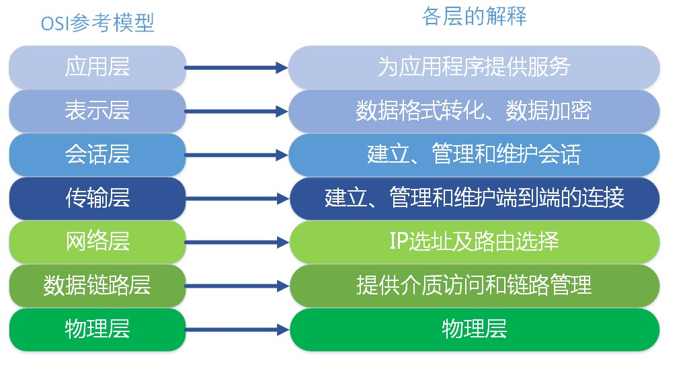

# 网络分层模型

## OSI 七层模型

**OSI( Open System Interconnect )**：

开放式系统互联，是 ISO(国际标准化组织)组织的网络互联模型

### 模型划分及各层功能定义

#### 物理层

所属层级：第一层

作用：通过物理介质传输比特流，实现信号的传输

常用设备：集线器、中继器、调制解调器、网线、双绞线、同轴电缆等传输介质

#### 数据链路层

所属层级：第二层

作用：将比特流组成字节，再将字节组合成帧，使用链路层地址(MAC 地址)来访问介质，并进行差错检测

**链路层的 2 个子层**：

+ 逻辑链路控制子层(LLC)

  定义了一些字段使上次协议能共享数据链路层，此子层并非必需

+ 媒体访问控制子层(MAC)

  主要处理 CSMA/CD( 带有冲突检测的载波侦听多路访问 ) 算法、数据出错校验、成帧等

常用设备：二层交换机

常见协议：ARP、RARP

#### 网络层

所属层级：第三层

作用：通过 IP 地址进行寻址，通过交换机或路由设备选择合适的路由，将源端送来的分组传送给目的端

常用设备：三层交换机、路由器

常见协议：IP、ICMP

#### 传输层

所属层级：第四层

作用：建立主机端到端的链接，为上层协议提供端到端的可靠和透明的数据传输服务，包括处理差错控制和流量控制等问题

常见协议：TCP、UDP

#### 会话层

#### 表示层

#### 应用层

## TCP/IP 模型

