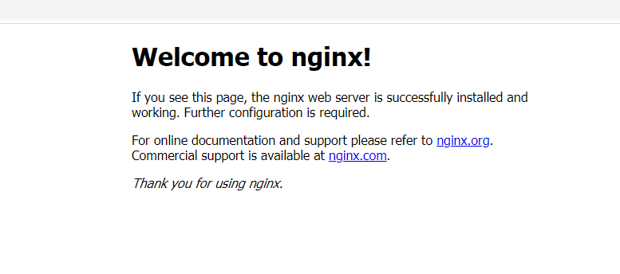

# Nginx 安装

## Linux 环境

**安装包下载**

Linux环境版本：centos 7
在网站：http://nginx.org/en/download.html 上下载相应的版本，本次下载 nginx-1.21.0.tar.gz 

**安装步骤**

+ 解压

使用 tar -zcxf nginx-1.21.0.tar.gz 命令，解压上述中下载的压缩包

+ 进入 nginx-1.21.0 目录下

  + 使用 ./configure 安装

    **如出现以下报错**:

    ./configure: error: the HTTP rewrite module requires the PCRE library

    **解决方法**：

    yum -y install pcre-devel

    安装完成后，重新使用 ./configure 进行安装

    **如出现以下报错**:

    ./configure: error: the HTTP gzip module requires the zlib library.

    **解决方法**：

    yum -y install zlib-devel

    安装完成后，重新使用 ./configure 进行安装，安装成功

  + 上述安装成功后，make && make install 进行安装

+ 安装成功后，进行访问，出现以下界面即可

  访问地址：XXXX.XXXX.XXXX.XXXX:80

 