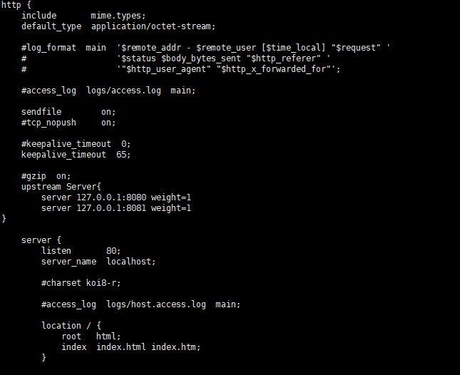

# 配置文件解析

## Nginx.conf 文件结构

安装成功后，查看 nginx.conf 文件，文件结构如下：

**全局配置块**：


作用：配置影响 nginx 全局的指令

可配置：

+ nginx 服务器用户组
+ nginx 进程 pid 存放路径
+ 日志存放路径
+ 配置文件引入
+ 运行生成 worker、process 数等

配置示例：

```
#user administrator administrators;  #配置用户或者组，默认为nobody nobody。
#worker_processes 2;  #允许生成的进程数，默认为1
#pid /nginx/pid/nginx.pid;   #指定nginx进程运行文件存放地址
error_log log/error.log debug;  #制定日志路径，级别。这个设置可以放入全局块，http块，server块，级别以此为：debug|info|notice|warn|error|crit|alert|emerg
```


**events 块**:


作用：配置影响 nginx 服务器与用户的网络连接

可配置：

+ 每个进程的最大连接数
+ 运行同时接受多个网络连接
+ 选取事件驱动模型处理连接请求
+ 开启多个网络连接序列化等

**http 块**:



作用：可嵌套多个 server ，配置代理、缓存、日志定义等

+ server 块：配置虚拟主机的相关参数，一个 http 可以有多个 server
+ location 块：配置请求的路由，以及各种页面的处理情况