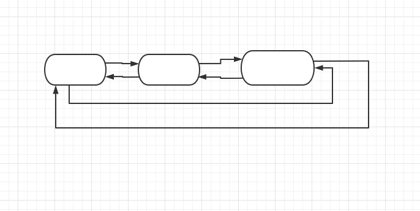

在 Python 中主要通过**引用计数器**来进行垃圾回收，但只通过引用计数器会存在循环引用的问题，引入标记清除和分代回收的机制进行完善。

##  引用计数器

### 1. 环状双向链表（refchain）



在运行 Python 文件时，底层会维护一张环状双向链表，所有创建的对象都会被加入这个 refchain 中，如：

```python
a = 99
b = "hello"
c = [1,3,4]
```

运行上面的代码时，会开辟一块空间用来存储 99、“hello”、[1,3,4]，这 3 个对象，，并把这三个对象加入 refchain 中，并存储一些基本的数据：

+ 对象的值
+ 引用的次数：默认是1
+ 上一个对象地址
+ 下一个对象地址


由上图可以看出，对于列表这种对象，除了存储以上 4 个基本的数据外，还会存储一些特有的数据，如：元素个数等。

```
d = a
```

当执行到此行时，由于 d 指向的还是 99 这个对象，因此会在 refchain 中将次对象的数据中的引用次数 +1，此时该对象的引用次数就变成 2 

```
del d
del a
```

当执行到 del b 这句时，会将 d 指向的对象，在 refchain 中将该对象的引用次数 -1 

当执行到 del a 这句时，会将 a 指向的对象，在 refchain 中将该对象的引用次数 -1 

此时，该对象的引用次数为 0 ，系统会对引用次数为 0 的对象进行垃圾回收或内存释放。

### 2. 循环引用


