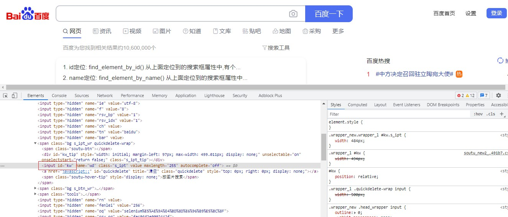

# selenium 定位方式

以百度搜索框为例：




常见定位方式有以下几种：

**1. 根据 id 进行定位**

```python
from selenium import webdriver
driver = webdriver.Chrom()
driver.get("https://www.baidu.com")
#通过元素的 id 进行定位元素
driver.find_element_by_id("kw").send_keys("test")
```

**2. 通过 name 定位**

```python
from selenium import webdriver
driver = webdriver.Chrom()
driver.get("https://www.baidu.com")
#通过元素的 name 进行定位元素
driver.find_element_by_name("wd").send_keys("test")
```

**3. 通过 class_name 定位**

```python
from selenium import webdriver
driver = webdriver.Chrom()
driver.get("https://www.baidu.com")
#通过元素的 class_name 进行定位元素
driver.find_element_by_class_name("s_ipt").send_keys("test")
```


