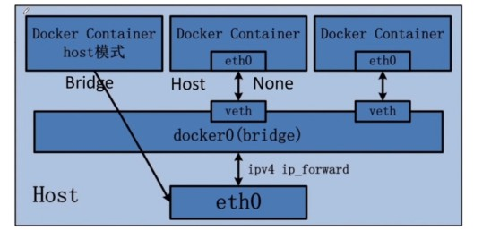

# Docker 网络

## 网络类型



+ Bridge (默认模式)

  host 与容器中的服务通过 bridge 连接

  容器有自己的 IP 地址

+ Host

  host 与服务器中的服务直接连接

  容器与 host 在同一局域网类

+ None

  无网络模式

## 端口映射

在 Bridge 模式下，需要使用到端口映射，运行镜像时，默认使用的时 Bridge 模式

有两种方式设置映射，以访问 Nginx 为例：

**映射指定端口**：

+ 将 host 中的 8080 端口映射到 nginx 容器中的 80 端口

  ```
  docker run -d -p 8080:80 hub.c.163.com/library/nginx
  ```

+  查看 8080 端口，端口处于 listen 状态

  ```
  [root@simlove003 ~]# netstat -na|grep 8080
  tcp        0      0 0.0.0.0:8080            0.0.0.0:*               LISTEN     
  tcp6       0      0 :::8080                 :::*                    LISTEN  
  ```

+ 访问 host:8080

  


**映射随机端口**：

+ 随机映射端口到容器的 80 端口

  ```
  docker run -d -P hub.c.163.com/library/nginx
  ```

+  查看进程 docker ps，可以看到随机端口 49154 被映射到 80 了

  ```
  [root@simlove003 ~]# docker ps
  CONTAINER ID   IMAGE                         COMMAND                  CREATED         STATUS         PORTS                                     NAMES
  3aa57a61343f   hub.c.163.com/library/nginx   "nginx -g 'daemon of…"   3 seconds ago   Up 2 seconds   0.0.0.0:49154->80/tcp, :::49154->80/tcp   strange_antonelli  
  ```

+ 查看 49154 端口处于 listen 状态

  ```
  [root@simlove003 ~]# netstat -na|grep 49154
  tcp        0      0 0.0.0.0:49154           0.0.0.0:*               LISTEN     
  tcp6       0      0 :::49154                :::*                    LISTEN 
  ```

+ 访问 host:49154 

  


