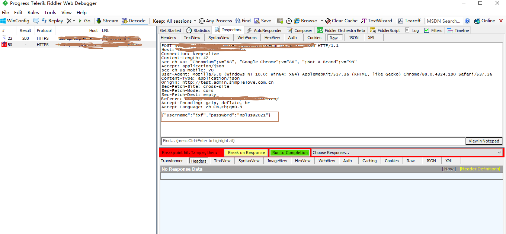
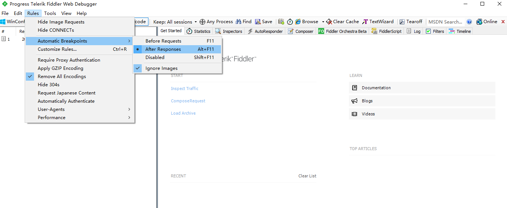

# 断点

## 1. 全局断点

+ 请求前断点

  设置全局请求前断点，会将所有经过 Fiddler 的接口在发送请求到 Fiddler 的时候，Fiddler 会暂停向服务器发送请求，此时，可以篡改接口的请求数据。

  全局请求前断点设置，在 Rules-Automatic Breakpoints 中选择 Before Resquests 如下：

  

  或者直接在状态栏，点击一下，待出现下面的图标，即表示开启全局请求前断点，在点击 2 下，表示取消断点：

  

  设置成功后，可以对请求的接口进行数据的修改，如：

  

  此时可以修改提交的数据，然后点击绿色的 Run to Completion 后，Fiddler 将该请求发送至服务器，获取服务器返回的数据

+ 请求后断点

  设置全局请求后断点， Fiddler 会接受所有接口返回的数据，此时不会直接返给前端，可以修改返回的数据。

  全局请求后断点设置，在 Rules-Automatic Breakpoints 中选择 after Resquests 如图：

  

  或者直接在状态栏，点击两下，待出现下面的图标，即表示开启全局请求前断点，在点击 1 下，表示取消断点：

  

  设置成功后，可以对请求的接口进行数据的修改，有以下两种方式：

  + 在左边的 list 界面中，点击响应后断点的接口，右边选择 response 中的 raw，修改返回数据后，点击 Run to Completion 即可将返回的数据返回给前端

    

  + 先设置 AutoResponder ，将需要修改返回数据的接口设置一定的规则，如下：

    

    返回的数据可选择 Fiddler 自带的一些返回值，或自己创建的一些返回值，设置完成后，必须 Enable rules。然后在点击 Run to Completion ，就会把上述中设置的返回值返回给前端。

    

## 2. 局部断点

局部断点是在局部的接口上进行断点，只是与全局断点的设置方式不一致，其余的数据操作部分可参考上面的全局断点部分。

+ 局部请求前断点

  在状态面板中输入：bpu token(url 中包含的值) 或者 bpu 完整url

  输入：bpu 即可取消断点

+ 局部请求后断点

  在状态面板中输入：bpafter token(url 中包含的值) 或者 bpafter 完整url

  输入：bpafter 即可取消断点

  

## 3. 断点的作用

+ 模拟网络中断
+ mock 数据
+ 可以测试一些极端的测试