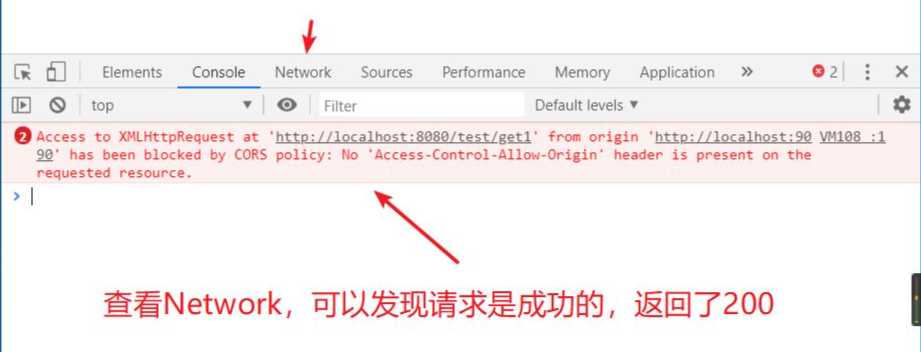

# 跨域

## 什么是跨域问题

前端调用的后端接口不属于同一个域（域名或端口不同），就会产生跨域问题，也就是说你的应用访问了该应用域名或端口之外的域名或端口 

### 为什么会出现跨域

受浏览器的**同源策略**的限制

## 同源策略

### 为什么要有同源策略

同源策略是页面中的一种安全策略

**举个没有安全策略的栗子**：

比如你打开一个银行站点，又不小心打开了一个恶意站点，在没有任何安全措施的情况下，恶意站点可以做很多事情：

+ 修改银行站点的 DOM、CSSOM 等信息
+ 在银行站点内部插入 JavaScript 脚本
+ 劫持用户登录的用户名和密码
+ 读取银行站点的 Cookie、IndexDB 等数据
+ 甚至还可以将这些信息上传至自己的服务器，这样就可以在你不知情的情况下伪造一些转账请求等信息 

**总结**：同源策略是用来保障**隐私和数据的安全** 

### 什么是同源

 如果两个 URL 的协议、域名和端口都相同，这两个 URL 就是同源，如：

| 当前页面 URL              | 被请求页面 URL                  | 是否同源 | 原因                     |
| ------------------------- | ------------------------------- | -------- | ------------------------ |
| http://www.test.com/      | http://www.test.com/index.html  | 是       | 协议、域名、端口号相同   |
| http://www.test.com/      | https://www.test.com/index.html | 否       | 协议不同（http/https）   |
| http://www.test.com/      | http://www.baidu.com/           | 否       | 主域名不同（test/baidu） |
| http://www.test.com/      | http://blog.test.com/           | 否       | 子域名不同（www/blog）   |
| http://www.test.com:8080/ | http://www.test.com:7001/       | 否       | 端口号不同（8080/7001）  |

### 同源策略

定义：

+  浏览器默认两个相同的源之间是可以相互访问资源和操作 DOM 的
+  两个不同的源之间若想要相互访问资源或者操作 DOM，有一套基础的安全策略的制约，称为同源策略 

####  同源策略主要表现在 DOM、Web 数据和网络这三个层面 

##### DOM 层面

 同源策略限制了来自不同源的 JavaScript 脚本对当前 DOM 对象读和写的操作 

