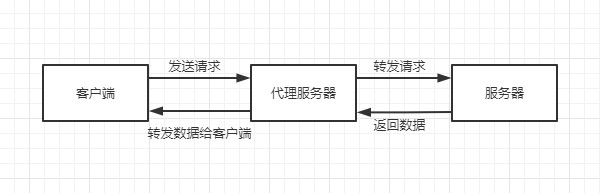
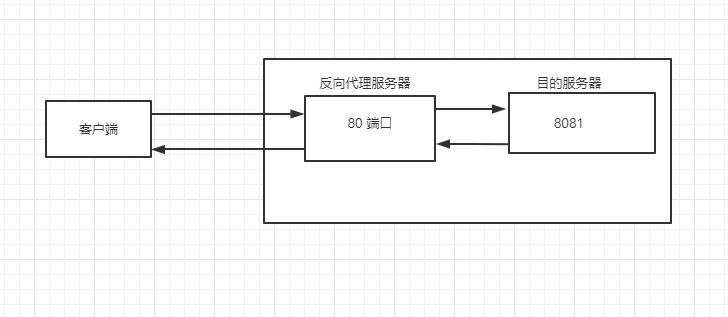
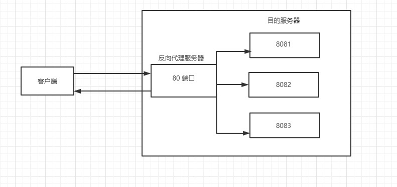
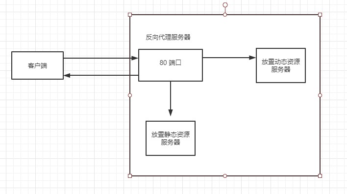

## Nginx 简介

### 1. 什么是 Nginx

Nginx 是一个高性能的 HTTP 和反向代理服务器，特点是占有内存少，并发能力强。Nginx 专为性能优化而开发，能经受高负载的考验，有报告表明能支持高达 50000 个并发连接数。

### 2. 反向代理

+ 正向代理

  在客户端（浏览器）配置代理服务器，通过代理服务器进行互联网访问

  

+ 反向代理

  客户端无需配置代理服务器，用户将请求发送到反向代理服务器上，反向代理服务器会根据内部的配置将相应请求转发到相应的目标服务器上，获取数据后再转发给客户端。整个过程中，反向代理服务器和目标服务器对外就是一个服务器，隐藏了目的服务器的地址。

  

### 3. 负载均衡

将请求分摊到不同的服务器上，减少单一服务器带来的风险，这种方式叫负载均衡。

### 4. 动静分离

将动态和静态资源分开放在不同的服务器上，使静态和动态资源由不同的服务器处理，加快解析速度，降低单服务器压力。

