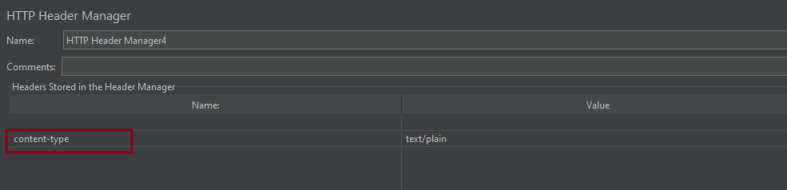

# HTTP 信息头管理

**界面介绍**

这个功能就是 HTTP 请求头中需要啥，就添加啥

先来看个例子：

测试计划下有 2 个线程组，在测试计划(后面简称 1)、线程组1(后面简称 2)、 HTTP2(后面简称 3)、HTTP3(后面简称 4) 下添加信息头管理器

**1 中的配置**：

**2 中的配置**:

**3 中的配置**：

**4 中的配置**：

结果查看：

**HTTP1 的结果**：

**HTTP2 的结果**：

**HTTP3 的结果**：

**总结**：

+ 测试计划下的信息管理器作用于所有线程组
+ 线程组下的信息管理器作用于当前线程组
+ HTTP 请求中会将测试计划、线程组、HTTP 请求下的信息管理器中的都加入到 HTTP 请求中
+ 同一类型的请求头，优先级最高的是 HTTP 中设置的