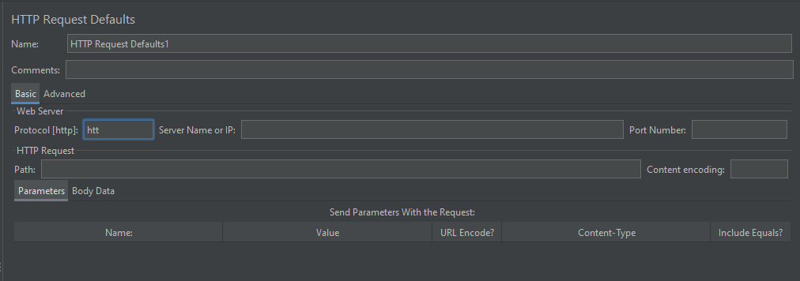
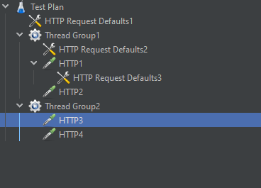
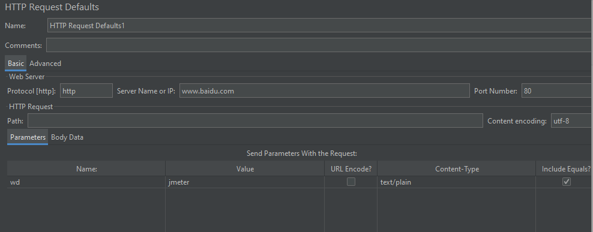
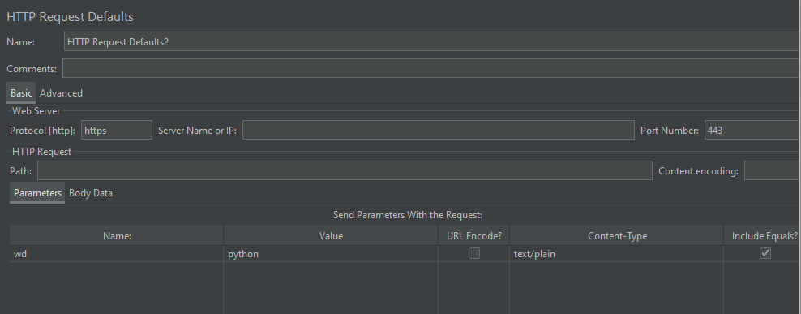
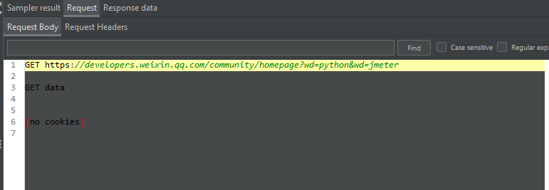

# HTTP 请求默认值

## 界面介绍

界面与 HTTP Resquest 类似，就不重复介绍字段值意思啦

HTTP 请求默认值，可以添加在测试计划、线程组、HTTP 请求下

**思考**：既然测试计划、线程组、HTTP 请求下都可以添加，那优先级顺序是什么样子的呢？

## 请求默认值优先级

先看个例子：

创建一个测试计划，下面创建 2 个线程组，每个线程组下创建 2 个 HTTP 请求，测试计划、线程组、HTTP 请求下分别创建一个 HTTP 请求默认值，如图：

配置如下：

**测试计划下的 HTTP 请求默认值配置**：

**线程组1 下的 HTTP 请求默认值配置**:

**HTTP1 下的 HTTP 请求默认值配置**:

**HTTP2 配置了个参数**:

其他 HTTP 请求暂无其他配置

运行查看结果：

