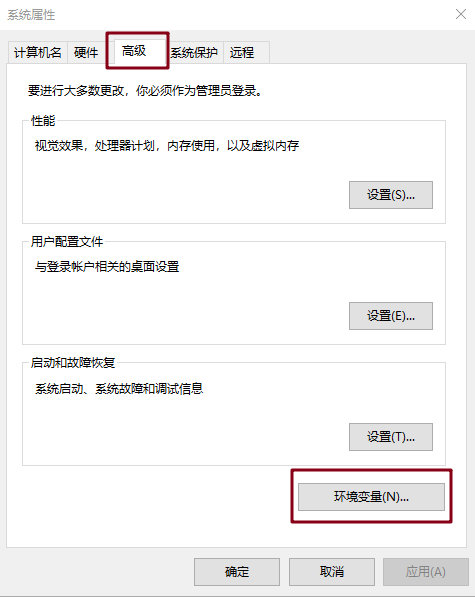
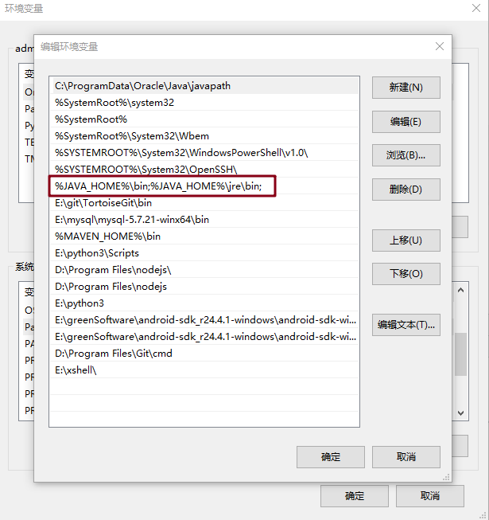

# Jmeter 安装

## 下载

http://jmeter.apache.org/ 下载最新版本的 JMeter，解压文件到任意目录

## 安装依赖环境

### JDK 安装

#### 下载

https://www.oracle.com/java/technologies/javase-jdk8-downloads.html

下载成功后进行安装，记住安装的目录

#### 配置 Java 环境

+ 在高级设置中点击环境变量选项

  

+ 在环境变量中添加新建一个 JAVA_HOME 变量，设置之前安装 JDK 的目录

  

+ 将 JAVA_HOME 配置到 path 中

  

+ 点击确定后，Java 环境变量就安装好了

### 配置 JMeter 环境

