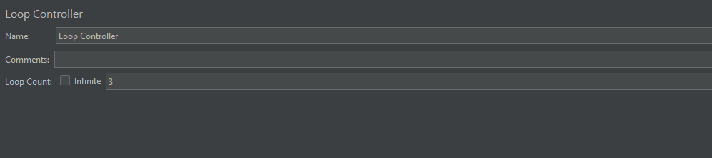

# Loop Controller

**界面**

右键 Add-->Logic Controller-->Loop Controller，添加 Loop Controller

参数说明：

**Loop Count**：循环次数

+ Infinite：无限循环
+ 自定义次数：可自定义要循环的次数

**循环次数与线程组循环次数的关系**：

可以理解为**父子关系**

例子：

线程组的线程数设置为 2 ，循环次数设置为 1，循环控制器的循环次数设置为 3，为了查看结果方便，新增了个

