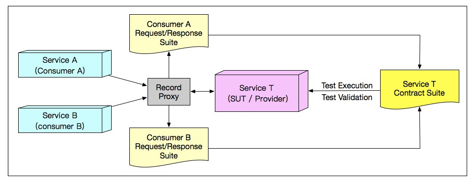

#  微服务下的 API 测试

## 微服务架构

### 单体结构

**概述**： 将所有的业务场景的表示层、业务逻辑层和数据访问层放在同一个工程中，最终经过编译、打包，并部署在服务器上 

**优点**： 发布简单、方便调试、架构复杂性低等 

**应用场景**：传统企业级应用软件

 **单体架构存在的问题** :

+  **灵活性差** 

   无论是多小的修改，也要打包发布整个应用，每次编译打包都要花费很长时间 

+  **可扩展性差** 

   高并发场景下，无法以模块为单位灵活扩展容量，不利于应用的横向扩展 

+  **稳定性差** 

   缺乏容错机制， 应用中任何一个模块有问题时，都可能会造成应用整体的不可用 

+  **可维护性差** 

   随着业务复杂性的提升，代码的复杂性也直线上升，业务规模比较庞大时，整体项目的可维护性会大打折扣 

### 微服务架构

**产生原因**：随着互联网产品的普及，应用所承载的流量越来越庞大，单体架构的问题被逐渐暴露并不断放大 

**概述**：大型复杂软件系统不再由一个单体组成，而是由一系列相互独立的微服务组成 ， 开发和部署都没有依赖 

**特点**：

- 每个服务运行在其独立的进程中，开发采用的技术栈也是独立的
- 服务间采用轻量级通信机制进行沟通，通常是基于 HTTP 协议的 RESTful API
- 每个服务都围绕着具体的业务进行构建，并且能够被独立开发、独立部署、独立发布
- 对运维提出了非常高的要求，促进了 CI/CD 的发展与落地

**存在的测试挑战**：

 一个应用是由很多相互独立的微服务组成，每个微服务都会对外暴露接口， 一个微服务通常还会去调用其他微服务 ，测试挑战主要来自两方面：

+ 过于庞大的测试用例数量

  **传统 API 测试的策略**：

  - 根据被测 API 输入参数的各种组合调用 API，并验证相关结果的正确性；
  - 衡量上述测试过程的代码覆盖率；
  - 根据代码覆盖率进一步找出遗漏的测试用例；
  - 以代码覆盖率达标作为 API 测试成功完成的标志

    **举个例子**：

   采用单体架构开发了一个系统，这个系统对外提供了3个Restful API接口

   设计测试策略：

  - 针对这 3 个API接口，分别基于边界值和等价类方法设计测试用例并执行；
  - 在测试执行过程中，启用代码覆盖率统计；
  - 假设测试完成后代码行覆盖率是80%，需要找到那些还没有被执行到的20%的代码行
  -  要保证代码覆盖率达到既定的要求，完成API测试

   **当我们采用微服务架构时，原本的单体应用会被拆分成多个独立模块，也就是很多个独立的service，原本单体应用的全局功能将会由这些拆分得到的API共同协作完成** 

  **改造上面的例子**：

   采用微服务架构，该系统被拆分成了 10 个独立的 service，每个 service 平均对外暴露 3 个 API 接口

  **采用传统 API 测试策略，存在的问题**：

  +  测试用例的数量多达 30 个 ，需要耗费大量的测试执行时间和资源 
  +  互联网模式下，由于发布周期的特殊性， 测试的执行时间非常有限

+ 微服务之间的耦合关系

例： 但是 Service T 的内部又调用了 Service X 和 Service Y， 如果 Service X 和 Service Y 由于各种原因处于不可用的状态，此时就无法对Service T进行完整的测试

  

**解耦方式**： 实现  **Mock Service** 来代替被依赖的真实 Service 

**关键点**： 能够模拟真实 Service 的 Request 和 Response 

**解决方法**：**基于消费契约的 API 测试**

**基于消费契约的 API 测试**：

举个栗子：

被测对象：Service T 

Service T 的使用者：Service A、Service B

三者之间的关系：

**思考**：

+ Service T 的使用者是确定的， 只有 Service A 和 Service B  
+  如果可以把 Service A 和 Service B 对Service T 所有可能的调用方式都测试到，那么就一定可以保证 Service T 的质量 
+ 可能存在某些 Service T 的其他调用方式会出错，但系统中并没有其他 Service 会以这种可能出错的方式来调用 Service T，不会影响整个系统的功能 

**问题转换**： 找到 Service A 和 Service B 对 Service T 所有可能的调用方式组成集合， 作为 Service T 的测试用例 

**测试用例集合本质**： Service T 可以对外提供的**服务的契约**， 称为“基于消费者契约的API测试” 

**问题解决方案**： 在逻辑结构上，在 Service T 前放置一个代理，所有进出 Service T 的 Request 和 Response 都会经过这个代理，并被记录成 JSON 文件，构成了 Service T 的契约 

原理过程：

**实际应用**：不可能在每个Service前去放置这样一个代理， 微服务架构中会存在一个叫作 API Gateway 的组件，用于记录所有 API 之间相互调用关系的日志，可以通过解析 API Gateway 的日志分析得到每个 Service 的契约 

**微服务测试的依赖解耦和 Mock Service**：

**契约的本质**： Request 和 Response 的组合，具体的表现形式往往是 JSON 文件 

**Mock Service 依据**： 契约的 JSON 文件 

**解耦服务之间的依赖**： 当用 Service X 的契约启动 Mock Service X 后，原本真实的 Service X 将被 Mock Service X 替代 